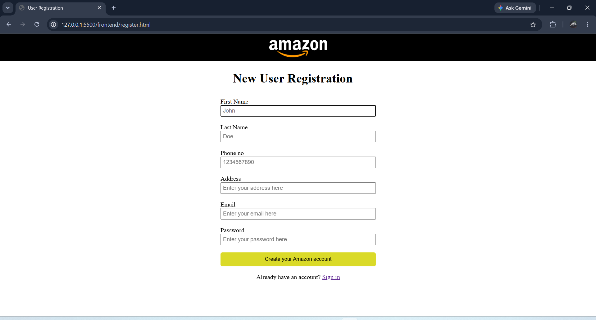
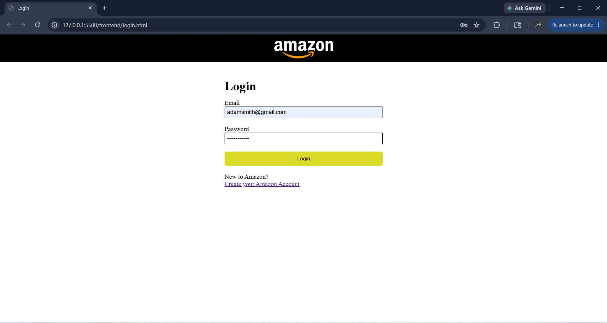
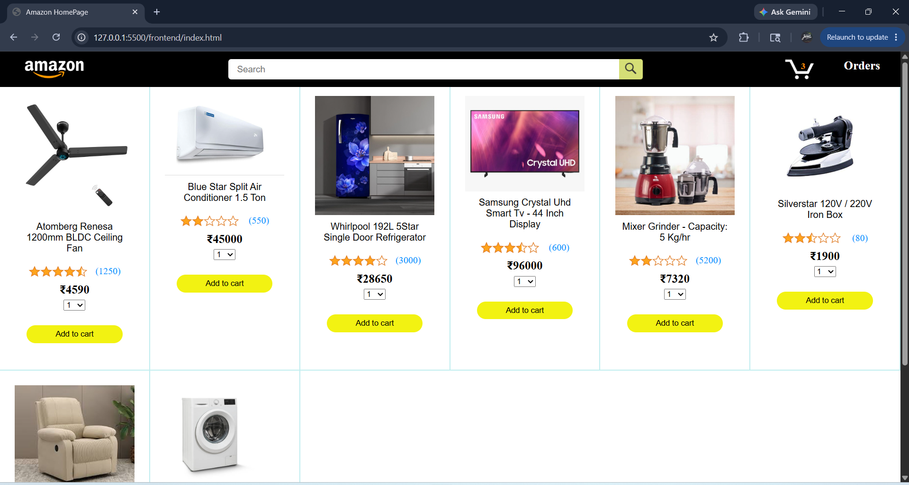
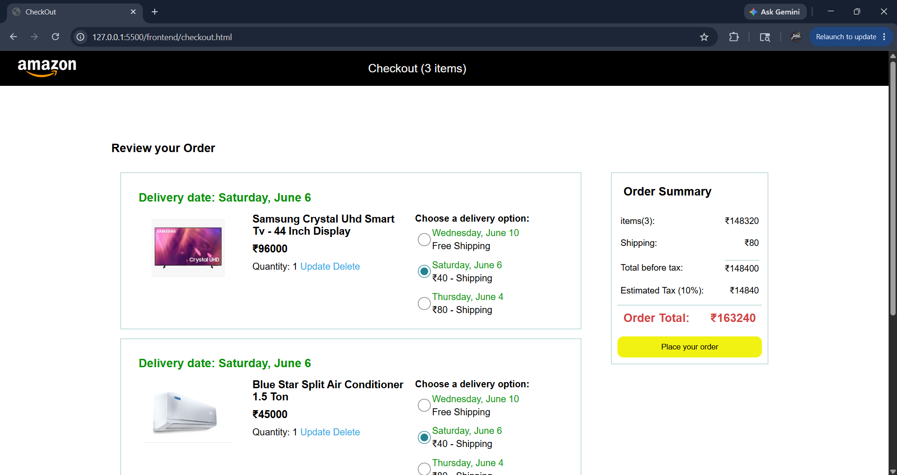
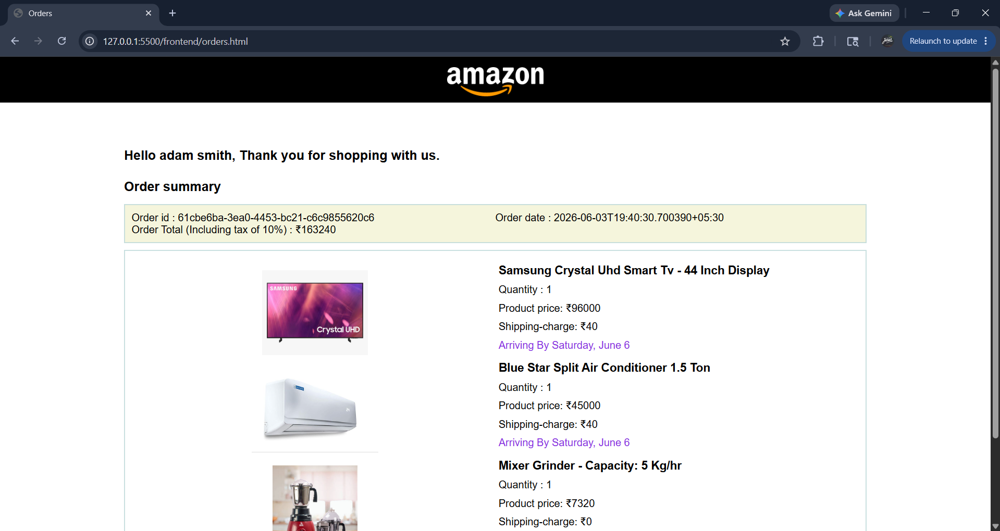

# Amazon-Clone FullStack project

## Overview

This project is a full-stack Amazon-inspired e-commerce application featuring user authentication, product management, shopping cart functionality, checkout, and order management. The backend is built with FastAPI and PostgreSQL, while the frontend uses HTML, CSS, and JavaScript.

## Features

- Product listing from backend database
- User registration and login
- Password hashing
- JWT authentication
- Protected user routes
- Add to cart using backend API
- Update cart quantity
- Update delivery option
- Delete cart items
- Checkout page using backend cart
- Place order
- Order history page
- PostgreSQL database integration


## Tech Stack

### Frontend
- HTML
- CSS
- JavaScript
- Fetch API
- LocalStorage for JWT token

### Backend
- Python
- FastAPI
- SQLAlchemy
- PostgreSQL
- Pydantic
- JWT Authentication
- Argon2 password hashing


## Project Structure

```text
Amazon-project/
│
├── frontend/
│   ├── index.html
│   ├── checkout.html
│   ├── orders.html
│   ├── login.html
│   ├── register.html
│   ├── styles/
│   ├── scripts/
│   └── images/
│
├── backend/
│   ├── app/
│   │   ├── models/
│   │   ├── schemas/
│   │   ├── routers/
│   │   ├── crud/
│   │   ├── database.py
│   │   ├── config.py
│   │   └── main.py
│   │
│   ├── requirements.txt
│   └── .env

```


## Backend API Overview

Products
- GET /products
- GET /products/{id}
- POST /products

Users
- POST /users
- GET /users/me

Login
- POST /login

Cart
- POST /cart
- GET /cart
- PUT /cart/{cart_id}
- DELETE /cart/{cart_id}

Orders
- POST /orders
- GET /orders


## Authentication Flow

Register user
↓
Login user
↓
Receive JWT token
↓
Store token in localStorage
↓
Send token in Authorization header
↓
Access protected routes


## Cart Flow

User clicks Add to Cart
↓
Frontend sends POST /cart with JWT token
↓
Backend identifies current user
↓
Cart item is stored in PostgreSQL
↓
Checkout page fetches cart using GET /cart


## Order Flow

User clicks Place Order
↓
Backend reads user's cart
↓
Creates order
↓
Creates order items
↓
Clears cart
↓
Orders page displays order history


## Setup Instructions

1. Clone the repository:
``` bash
git clone <your-repository-link>
cd Amazon-project
```

2. Backend setup:

```bash
cd backend
python -m venv venv
```

Activate virtual environment:
```bash
venv\Scripts\activate
```

Install dependencies:
```bash
pip install -r requirements.txt
```

3. Create .env file

```env
DATABASE_HOSTNAME=localhost
DATABASE_PORT=5432
DATABASE_NAME=your_database_name
DATABASE_USERNAME=postgres
DATABASE_PASSWORD=your_password

SECRET_KEY=your_secret_key
ALGORITHM=HS256
ACCESS_TOKEN_EXPIRE_MINUTES=30
```


4. Run backend

```bash
uvicorn app.main:app --reload
```

Backend runs at:
```bash
http://127.0.0.1:8000
```

Swagger docs:
```bash 
http://127.0.0.1:8000/docs
```

5. Run frontend

Open frontend pages using Live Server.

```bash
http://127.0.0.1:5500/frontend/login.html
```

## Screenshots

### Register Page



### Login Page



### Products Page



### Checkout Page



### Orders Page




## AUTHOR
Paul Daniel