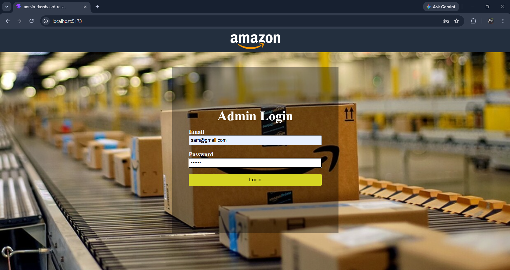
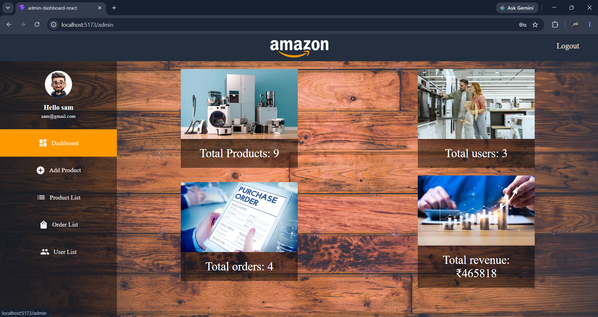
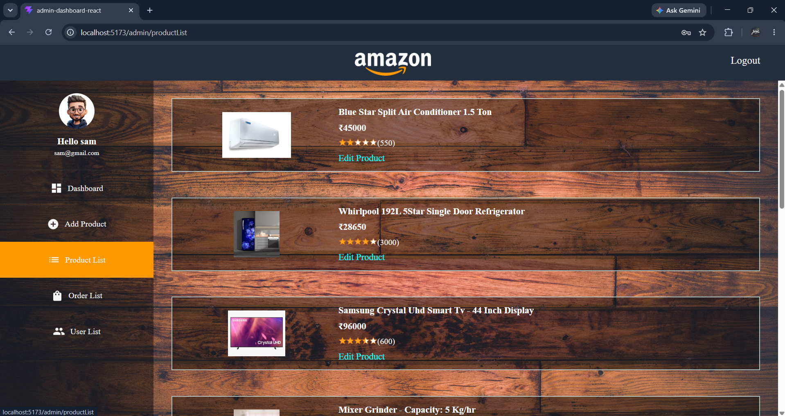
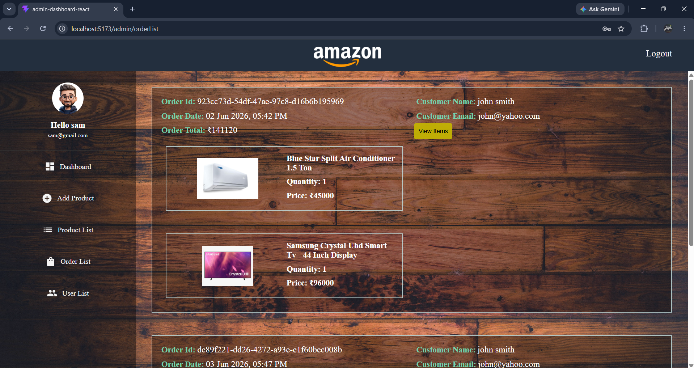
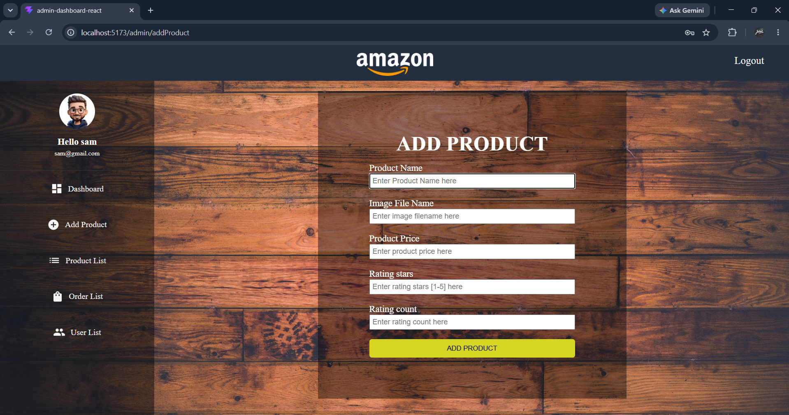
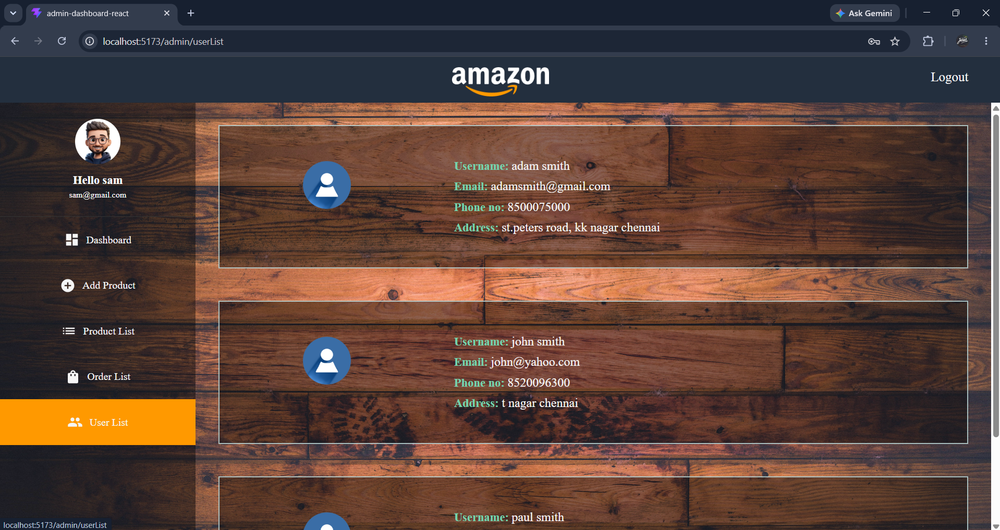

# Amazon-Clone FullStack project


## Overview

This project is a full-stack Amazon-inspired e-commerce application featuring user authentication, product listing, shopping cart functionality, checkout, order management, and a React-based admin dashboard.

The customer-facing frontend is built using HTML, CSS, and JavaScript. The admin dashboard is built with React.js. The backend is built with FastAPI and PostgreSQL.

## Features

## Features

- Customer authentication with JWT and password hashing
- FastAPI endpoints fetch and serve PostgreSQL data to both the customer frontend and React admin dashboard
- Product listing from PostgreSQL database
- Cart management: add, update quantity, update delivery option, and delete items
- Checkout flow with order creation and order history
- React-based admin dashboard with role-based access
- Admin product management: add, view, and update products
- Admin order management: view orders, customer details, and order items
- Admin user listing and dashboard statistics


## Tech Stack

### Frontend
- HTML
- CSS
- JavaScript
- Fetch API
- LocalStorage for JWT token

### Admin Dashboard
- React.js
- React Router DOM
- CSS
- Fetch API
- JWT-based protected admin routes

### Backend
- Python
- FastAPI
- SQLAlchemy
- PostgreSQL
- Pydantic
- JWT Authentication
- Argon2 password hashing


## Project Structure

```text
Amazon-project/
│
├── frontend/
│   ├── index.html
│   ├── checkout.html
│   ├── orders.html
│   ├── login.html
│   ├── register.html
│   ├── styles/
│   ├── scripts/
│   └── images/
│
├── admin-dashboard-react/
│   ├── public/
│   ├── src/
│   │   ├── assets/
│   │   ├── components/
│   │   ├── pages/
│   │   ├── styles/
│   │   ├── App.jsx
│   │   └── main.jsx
│   ├── package.json
│   └── vite.config.js
│
├── backend/
│   ├── app/
│   │   ├── models/
│   │   ├── schemas/
│   │   ├── routers/
│   │   ├── crud/
│   │   ├── database.py
│   │   ├── config.py
│   │   └── main.py
│   │
│   ├── requirements.txt
│   └── .env

```


## Backend API Overview

Products
- GET /products
- GET /products/{id}
- POST /products

Users
- POST /users
- GET /users/me

Login
- POST /login

Cart
- POST /cart
- GET /cart
- PUT /cart/{cart_id}
- DELETE /cart/{cart_id}

Orders
- POST /orders
- GET /orders

Admin
- GET /admin/stats
- POST /admin/add_product
- GET /admin/get_products
- GET /admin/get_orders
- GET /admin/get_order_items/{order_id}
- GET /admin/get_users
- GET /admin/get_product/{product_id}
- PUT /admin/update_product/{product_id}


## Authentication Flow

```text
Register user
↓
Login user
↓
Receive JWT token
↓
Store token in localStorage
↓
Send token in Authorization header
↓
Access protected routes
```


## Cart Flow

```text
User clicks Add to Cart
↓
Frontend sends POST /cart with JWT token
↓
Backend identifies current user
↓
Cart item is stored in PostgreSQL
↓
Checkout page fetches cart using GET /cart
```

## Order Flow

```text
User clicks Place Order
↓
Backend reads user's cart
↓
Creates order
↓
Creates order items
↓
Clears cart
↓
Orders page displays order history
```

## Admin Dashboard Flow

```text
Admin logs in
↓
Backend verifies email, password, and role
↓
JWT token is stored in localStorage
↓
Admin dashboard fetches protected data using Authorization header
↓
Admin can view dashboard stats, products, orders, order items, and users
↓
Admin can add and update products
```


## Setup Instructions

1. Clone the repository:
``` bash
git clone <your-repository-link>
cd Amazon-project
```

2. Backend setup:

```bash
cd backend
python -m venv venv
```

Activate virtual environment:
```bash
venv\Scripts\activate
```

Install dependencies:
```bash
pip install -r requirements.txt
```

3. Create .env file

```env
DATABASE_HOSTNAME=localhost
DATABASE_PORT=5432
DATABASE_NAME=your_database_name
DATABASE_USERNAME=postgres
DATABASE_PASSWORD=your_password

SECRET_KEY=your_secret_key
ALGORITHM=HS256
ACCESS_TOKEN_EXPIRE_MINUTES=30
```


4. Run backend

```bash
uvicorn app.main:app --reload
```

Backend runs at:
```bash
http://127.0.0.1:8000
```

Swagger docs:
```bash 
http://127.0.0.1:8000/docs
```

5. Run frontend

Open frontend pages using Live Server.

```bash
http://127.0.0.1:5500/frontend/login.html
```


6. Run admin dashboard

```bash
cd admin-dashboard-react
npm install
npm run dev
```

Admin dashboard runs at:

```bash
http://localhost:5173
```

## Admin Access

The application supports role-based authentication. Regular users can access customer features such as cart and orders. Users with the `admin` role can access protected admin dashboard routes and admin APIs.


## Screenshots

### Admin Dashboard

### Admin Login Page



### Admin Dashboard



### Admin Product List



### Admin Order List



### Admin Add Product Page



### Admin User List




### Customer-frontend

### Register Page


### Login Page


### Products Page


### Checkout Page


### Orders Page


## AUTHOR
Paul Daniel